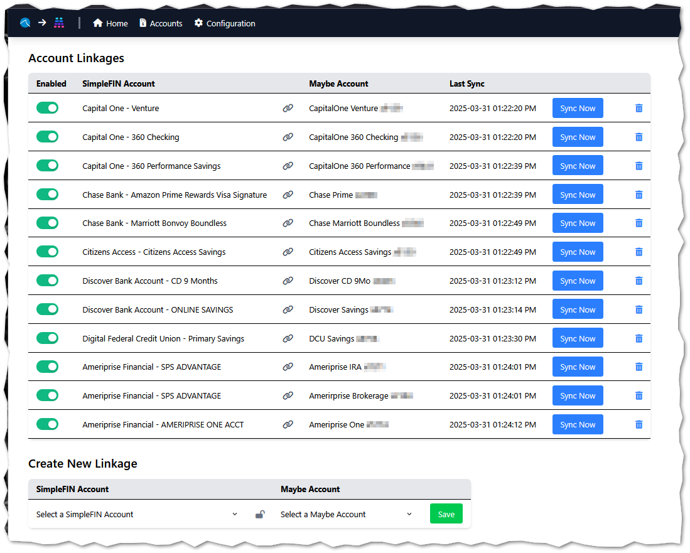
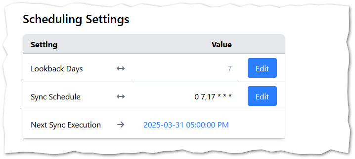

# SimpleFIN to Maybe

A project to synchronize transaction data from [SimpleFIN](https://beta-bridge.simplefin.org/) to a self-hosted [Maybe](https://github.com/maybe-finance/maybe) instance.

## Premise

The project is intended to be deployed alongside a self-hosted Maybe instance.  It provides an interface to save an "Account Linkage" between your SimpleFIN accounts and your Maybe accounts.  

Once linked, you can define a cron schedule for automatic synchronization of transactions and account balances, or synchronize manually:

## Installation Instructions

[Self-hosted with Docker](docs/docker.md)

## Configuration Instructions

[Web App Configuration](docs/config.md)

## Recommendations

In Maybe, manually sync your accounts frequently.

Also refresh (F5) your browser often.

## To Do

- [x] Transactions
- [x] Balances
- [X] Docker Compose
- [X] Web UI
- [ ] Securities/Trades/Holdings
- [ ] More...?
