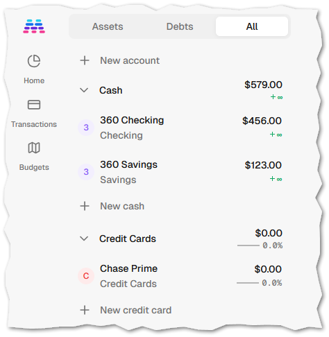
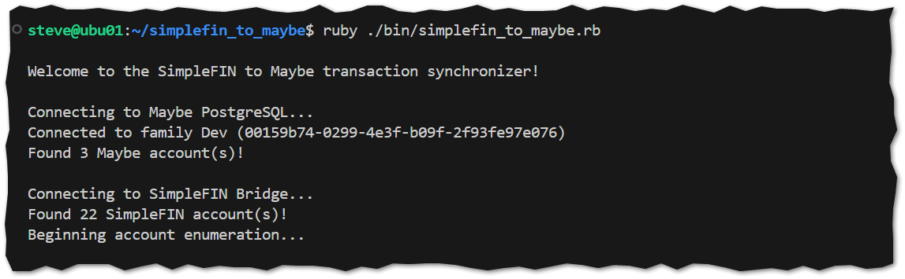
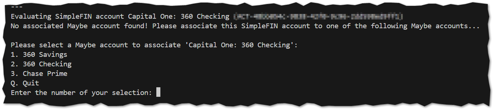
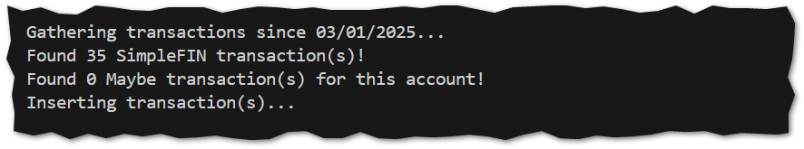
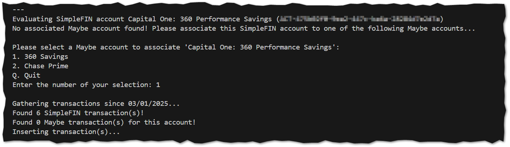
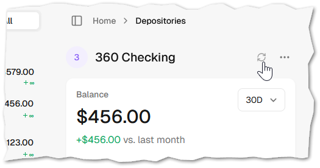
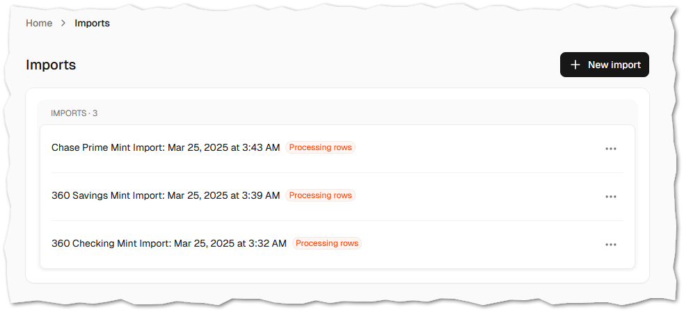
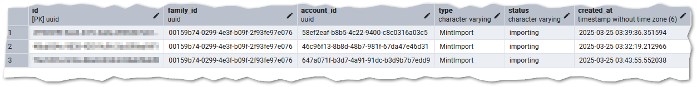
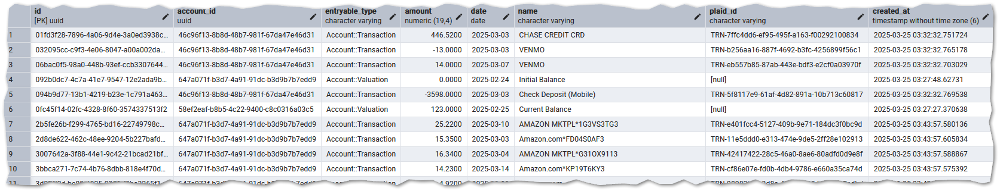

# SimpleFIN to Maybe

A project to synchronize transaction data from [SimpleFIN](https://beta-bridge.simplefin.org/) to a self-hosted [Maybe](https://github.com/maybe-finance/maybe) instance.

## Pre-requisites

1. [Ruby](https://www.ruby-lang.org/en/downloads/)
1. A SimpleFIN [Access Token (Step 2)](https://beta-bridge.simplefin.org/info/developers)
1. An exposed port to your self-hosted Maybe instance's PostgreSQL container/database

## Installation

1. `git clone https://github.com/steveredden/simplefin_to_maybe.git`
1. `cd simplefin_to_maybe`
1. `bundle install`
1. Rename `.env.example` to `.env` and fill out each environment variable

## Execution Steps

1. `ruby ./bin/simplefin_to_maybe.rb`

## Workflow

The utility requires that you have created your various accounts in Maybe before execution:

 \
&nbsp;&nbsp;&nbsp;&nbsp;*Staged accounts in Maybe*

The utility will interact with the PostgreSQL database, retrieving your `family` id, and any accounts created in your instance.  It also retrieves all accounts connected in your SimpleFIN account.

 \
&nbsp;&nbsp;&nbsp;&nbsp;*Execution and retrieval of accounts*

Next, you must associate each SimpleFIN account with the Maybe account by selecting an option:

 \
&nbsp;&nbsp;&nbsp;&nbsp;*Choose `2` to link these accounts, or `Q` to skip this account*

The utility will retrieve any existing and previously-synchronized transactions, and insert anything new:

 \
&nbsp;&nbsp;&nbsp;&nbsp;*Inserting any new transactions*

The utility will continue to loop through all SimpleFIN accounts, asking for linkages, and synchronizing all new transactions:

 \
&nbsp;&nbsp;&nbsp;&nbsp;*Un-linked accounts are presented as candidates, and new transactions are synchronized*

The account linkage is saved within the PostgreSQL database, so during subsequent executions you will not need to re-associate accounts.

After completion be sure to manually `Sync Account` in the Maybe web interface:

 \
&nbsp;&nbsp;&nbsp;&nbsp;*Syncing forces balance calculations*

## Technical Details

The utility stores the SimpleFIN-account-to-Maybe-account linkage as a `Mint Import`:

The SimpleFIN account uuid (removing the leading `ACT-`) is "stuffed" as the `imports.id` uuid:

> [!IMPORTANT]
> **Do not edit or delete these import records!**

Similarly, the SimpleFIN transaction uuid is "stuffed" into the `account_entries.plaid_id` table and column:

## To Do

- [x] Transactions
- [ ] Securities Trades
- [ ] More...?
