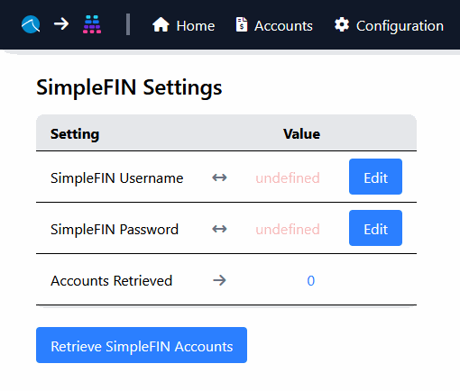
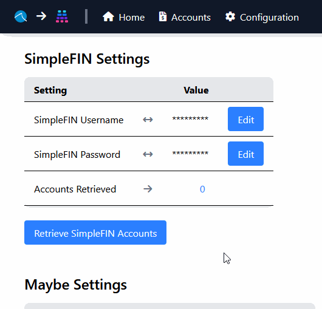
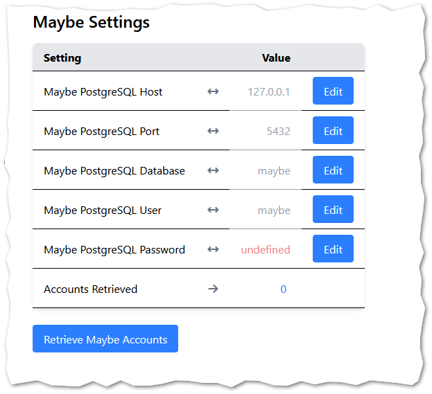
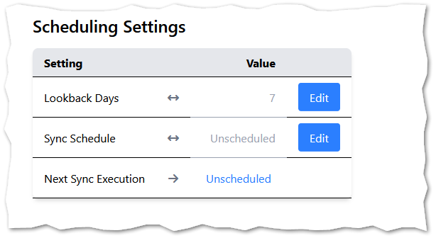
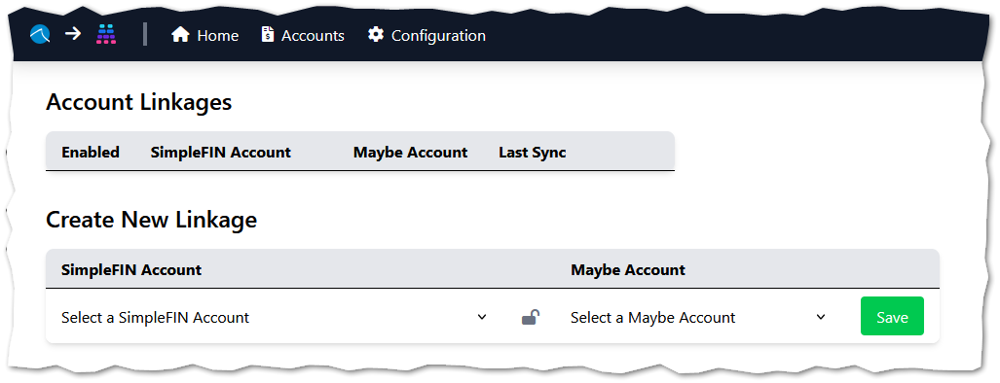

# Configuring SimpleFIN to Maybe

## Pre-requisites

1. A SimpleFIN [Access Token (Step 2)](https://beta-bridge.simplefin.org/info/developers)
   * Written guide herein:  [Getting your username+password from an Access Token](./simplefin-auth.md)
1. An exposed port to your self-hosted Maybe instance's PostgreSQL container/database

## Configuration

Navigate to the Configuration page

### Step 1: Add your SimpleFIN Credentials

Edit both `SimpleFIN Username` and `SimpleFIN Password`

> [!NOTE]
> `SimpleFIN Username` and `SimpleFIN Password` are the 64-character strings separated by a colon (`:`) \
> &nbsp;Follow the link in the Pre-requisites for instructions



Once defined click `Retrieve SimpleFIN Accounts`



### Step 2: Add your Maybe Configuration

A connection to the maybe PostgreSQL instance needs to be established.

Edit the necessary fields:



Look at the directory for your *Maybe* instance, specifically the `.env` file and the `docker-compose.yml` for relevant details.

You will likely need to expose a port on your *Maybe* stack's `db` service:

For example, if your *Maybe* docker-compose.yml contains the following for the `db` service:
```yaml
...
  db:
    image: postgres:16
    restart: unless-stopped
    volumes:
      - postgres-data:/var/lib/postgresql/data
    environment:
      <<: *db_env
...
```

...you would expose a port like so:
```yaml
...
  db:
    image: postgres:16
    restart: unless-stopped
    ports:
      - 9404:5432
    volumes:
      - postgres-data:/var/lib/postgresql/data
    environment:
      <<: *db_env
...
```

Once defined, click the `Retrieve Maybe Accounts` button:


### Step 3: Add your Scheduling Configuration

If you would like to change the default `Lookback Days` of 7, you may edit that setting.



The `Sync Schedule` setting expects a cron schedule expression for queueing automatic background synchronizations of all *Account Linkages*.

Use [https://crontab.guru](https://crontab.guru/#0_19_*_*_*) to define an appropriate expression.

All **Enabled** *Account Linkages* will be synchronized on this schedule.

#### Step 4: Create Account Linkages

On the `Home` page, associate your SimpleFIN account with the corresponding Maybe account in the *Create New Linkage* section:



You are now able to manually syncrhonize transactions and balances from SimpleFIN to Maybe
