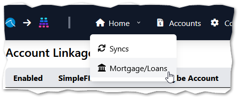
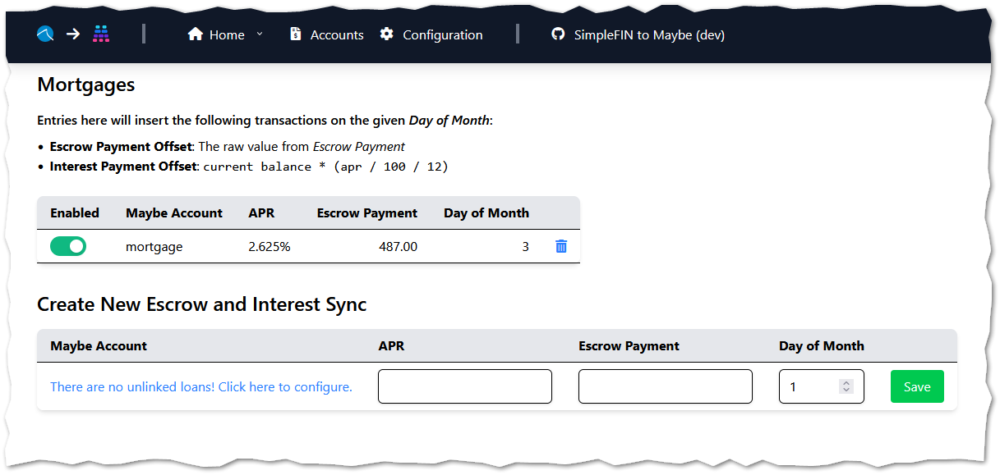

# Mortgage & Loan Sync

## Problem and Solution

When paying monthly towards a mortgage or loan, your money likely goes towards multiple balances:

1. Principal
1. Interest
1. Escrow

The **Interest** and **Escrow** payments do not impact your loan/mortgage's valuation, so adding accompanying transactions for these makes the valuation more accurate.

Example:  If I have a *mortgage* with a balance of `$421221.42` and an APR of `2.625%`, then synchronize a transaction from my *savings account*, a portion of that payment went towards interest and escrow.  Those portions should not deduct from my overall balance, as they were not paid towards the principal.

The **Mortgages** feature will automatically create transactions that offset these payment types, so that the balance of your account is more accurate:

The interest due on a certain date can typically be calculated as `interest = current balance * (apr / 100 / 12)` or `421221.42 * (2.625 / 100 / 12) = 921.42`

Escrow is typically static and divided evenly over the course of a year

## Setup

Access the **Mortgage/Loans** feature in the top dropdown menu:

Choose a *Maybe* account of type `Loan`, specify your **APR**, **Escrow Payment** (or `0` if you do not wish to create an Escrow transaction), and **Day of Month** to create the transactions on.

If you'd the inserted transactions to be considered `One-Time` in *Maybe* (and thus \*not\* included in Budgeting, etc.), use the **Exclude** checkbox:

## Recommendations

* Set the **Day of Month** to be a few days *before* your payment/transaction takes place so that the interest calculation uses the appropriate balance
